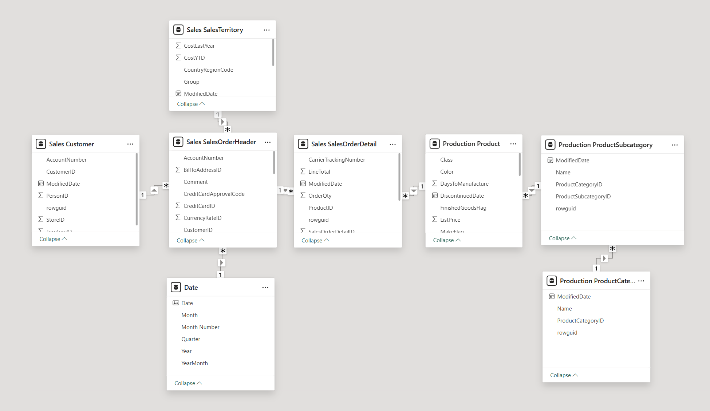
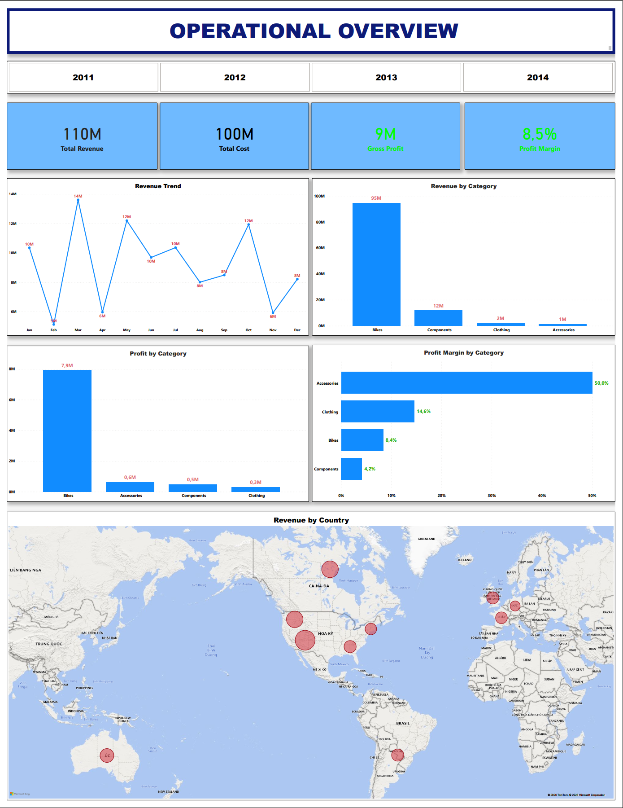
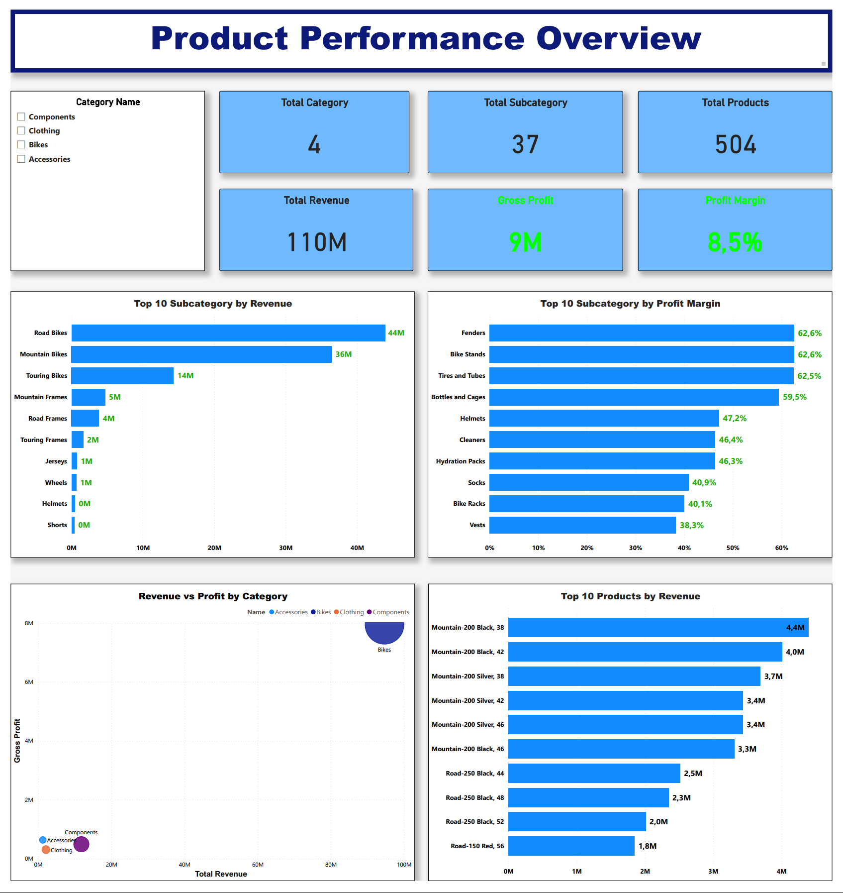
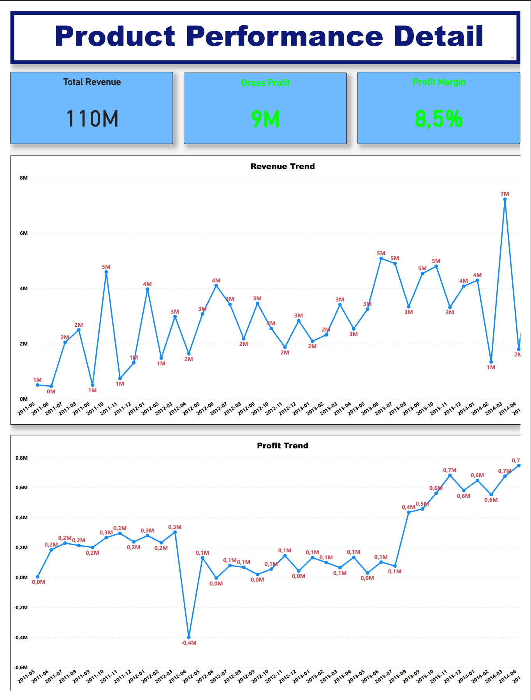

# 📊 Financial Performance & Growth Analysis – AdventureWorks 2019

## 📌 Project Overview
- This project delivers a financial performance analysis using the AdventureWorks2019 database.  
- The objective is to evaluate revenue growth sustainability, profitability trends, and territory performance over a 4-year period using advanced SQL techniques and an interactive Power BI dashboard.
  
## 🏢 Business Problem
AdventureWorks wants to evaluate long-term revenue growth and identify high-performing territories.  
Management needs a clear view of:
  - Is revenue growing sustainably?
  - Which territories drive the most revenue?
  - Which regions show strongest long-term growth (CAGR)?
  - Where should expansion strategy focus?
This project answers those questions using structured SQL analysis and interactive dashboards.

## 🎯 Business Objectives
- Analyze Year-over-Year (YoY) revenue and profit growth
- Calculate 4-year CAGR (Compound Annual Growth Rate)
- Evaluate revenue and profitability by Sales Territory
- Measure gross margin and contribution %
- Identify high-growth and high-margin regions
- Build an executive-level Power BI dashboard  

## 🛠 Tools & Technologies
- SQL Server (T-SQL)
- Window Functions (LAG)
- CTE (Common Table Expressions)
- Power BI (Data Modeling & Visualization)

## 🧠 SQL Techniques Demonstrated
- CTE (Common Table Expressions)
- Window Functions (LAG)
- Financial KPI calculation (YoY, CAGR)
- Multi-table JOIN
- NULL handling (NULLIF)
- Revenue aggregation and growth modeling
- FIRST_VALUE() & LAST_VALUE()
- Window Frame specification
- CAGR calculation using POWER()
- Financial modeling logic in SQL

## 📂 Dataset
Database: AdventureWorks2019  
Main tables used:
- Sales.SalesOrderHeader
- Sales.SalesTerritory
- Sales.SalesOrderDetail
- Production.Product
- Production.ProductSubcategory
- Production.ProductCategory

## 🧩 Data Model


- The data model follows a snowflake schema structure.
- The central fact table is **SalesOrderDetail**, which stores transactional sales data including quantity and line totals.
- Dimension tables provide additional context for analysis:
  - **Customer** → customer information
  - **Date** → time-based analysis
  - **Product** → product information
  - **ProductSubcategory** → product grouping
  - **ProductCategory** → high-level product classification
  - **SalesTerritory** → regional sales analysis

## 🔎 Key Analysis

### 1️⃣ Yearly Revenue & YoY Growth
- Aggregated revenue by year
- Used LAG() to calculate previous year revenue
- Calculated YoY growth %
- Compared revenue growth with profit growth to assess growth quality

### 2️⃣ 4-Year CAGR
CAGR Formula: CAGR = (Ending Value / Beginning Value) ^ (1 / Number of Years) - 1
Applied to:
- Overall company revenue
- Revenue by Territory
- Measured sustainable long-term growth using CAGR to complement YoY analysis.

### 3️⃣ Territory Financial Performance
- Joined SalesOrderHeader with SalesTerritory
- Calculated revenue and profit contribution %
- Analyzed Gross Margin % by territory
- Ranked territories by revenue and CAGR
- Identified high-growth vs high-revenue markets

## 📊 Power BI Dashboard
Dashboard Structure
The interactive Power BI dashboard consists of 3 main report pages:

1️⃣ **Executive Overview**
Provides a high-level financial summary including:
  - Total Revenue
  - Total Profit
  - Gross Margin %
  - YoY Growth
  - 4-Year CAGR
Visualizations include:
  - Revenue vs Profit trend line
  - KPI cards
  - Territory revenue contribution
This page allows executives to quickly evaluate overall financial performance.

2️⃣ **Product Performance Analysis**
Focuses on product category profitability.
Key metrics:
  - Revenue by Product Category
  - Profit by Product Category
  - Gross Margin comparison
  - Product contribution analysis
This helps identify which product categories drive revenue and profit.

3️⃣ **Product Detail (Drill-through)**
Provides detailed analysis for individual products.
Features:
  - Drill-through from product category
  - Revenue trend by product
  - Profitability analysis
  - Product-level performance comparison
This enables deeper investigation into product performance.

## 📷 Dashboard Preview

  ### Executive Overview
  
  ### Product Performance
  
  ### Product Detail
  

## 📊 Key Results
* Total Revenue (4 Years): $123.22M  
* Total Profit (4 Years): $9.37M  
* Average Gross Margin: 8.53%  
* 4-Year CAGR: 51.24%  
* Average YoY Growth: 47.30%  
* Highest Revenue Territory: Southwest  
* Fastest Growing Territory: France

## 📈 Key Insights
- Revenue shows consistent upward growth trend
- North America region, particularly Southwest territory, dominates revenue contribution
- Some territories show higher CAGR despite lower total revenue
- Growth rate analysis helps identify emerging markets
- Gross margin remains relatively stable at 8.53%, indicating consistent cost structure despite rapid revenue growth
- Europe generates the highest revenue.
- Mountain bikes are the top selling category.
- Sales show strong seasonality in Q1 and Q4

## 🚀 Business Impact
This analysis enables management to:
- Assess revenue sustainability and growth quality
- Compare financial performance across territories
- Identify high-growth and high-margin regions
- Support data-driven strategic expansion decisions
- Monitor profitability beyond top-line revenue metric

## 📁 Repository Structure
```
adventureworks-sales-analysis
│
├── sql
│   └── sales_analysis.sql
│
├── dashboard
│   └── adventureworks_dashboard.pbix
│
├── images
│   ├── executive_overview.png
│   ├── product_performance.png
│   ├── product_detail.png
│   └── data_model.png
│
└── README.md  
```

## 👤 Author
Nam Tran  
Aspiring Data Analyst  

Skills:
SQL • Python • Power BI • Financial Analytics
